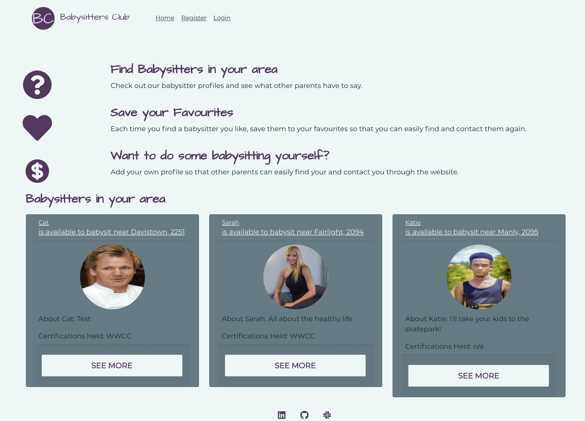
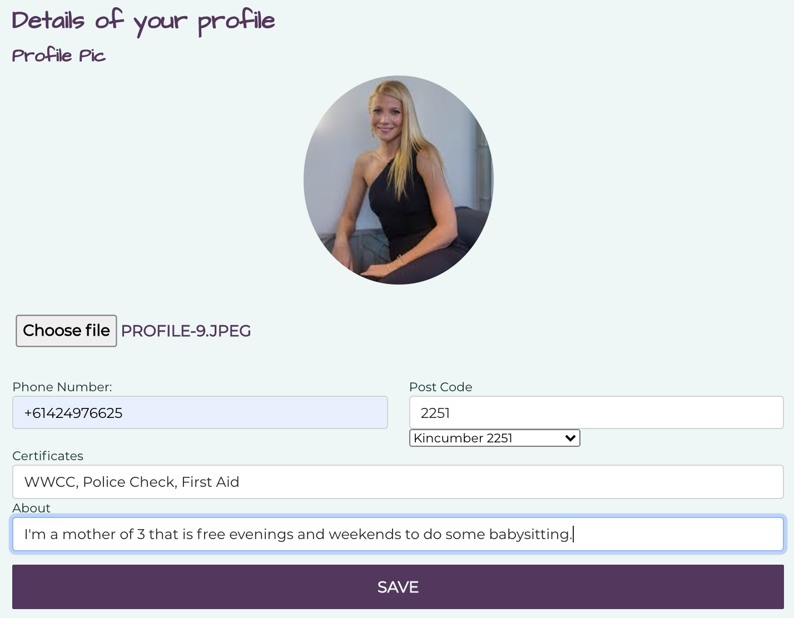
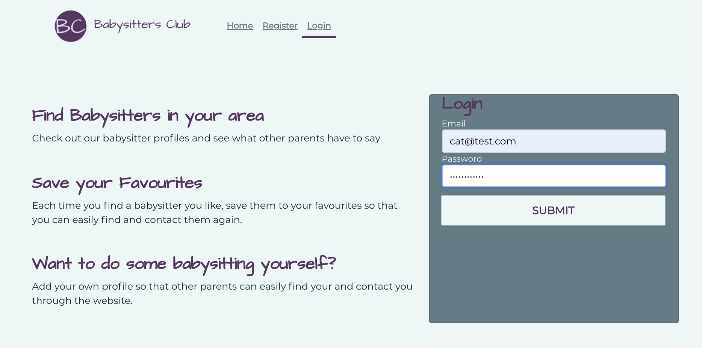
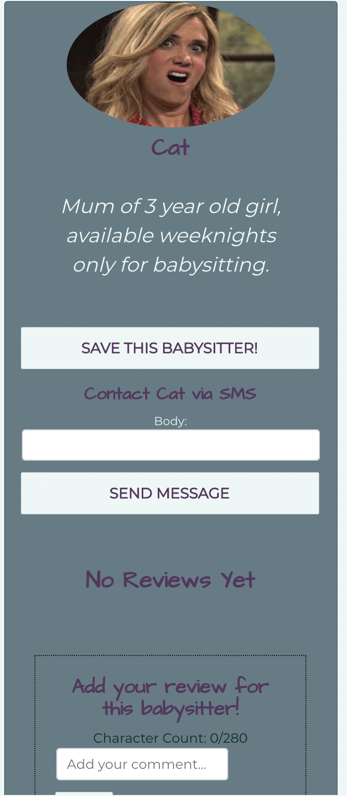

# babysitters-club
A MERN stack application where people can review and rate babysitters in their area. 

## Description & LIVE DEPLOYED WEBSITE
---
The app can be viewed live [here](https://babysittersclub.herokuapp.com/).  For more information see below. 

What works:
 - Login and Register both work with JWT
 - Add a babysitter profile 
    - Utilises an API (geonames) to search using the postcode to return a list of suburbs that match the postcode
    - Image Upload service so that you can display a profile pic
    - Pulls the Name and Email from the User model
    - The phone number entry has a regex that I developed specifically for this as I needed the number in a very spcific format.  Very handy to have this knowledge
 - View specific babysitters and their details
    - Ability to save the babysitter as a favourite (and delete them if they are no longer a favourite)
    - Can send the babysitter an SMS via TWILIO (which goes to their AU mobile number) requesting their services
    - Can read other peoples reviews on the babysitter as well as leave your own
 - PWA - this app is downloadable!

What's still in progress:
 - Geonames API only works on http, not https so I have a plan to move to an Axios query which has a no ssl feature. 
 - Utilising the geolation and location of babysitter to only show babysitters in that person's local area
 - Update profile - this button does not work yet and so has been hidden
 - PWA - I'd like to further extend this to have babysitters being saved offline in local storage
 - A favourites button that can be added anywhere on the website so you can favourite a babysitter from any page, rather than just their full babysitter page

Future Developments:
 - Eventually I'd like to website to also extend the ability to post a job and assign it to a babysitter.  Hours will then be confirmed/amended and payment made directly throught the website.  As anyone can attest, having cash on hand for a babysitter can be a hassle!

## Screenshots
---
The following images show the web application's appearance and functionality: 
The homepage which displays the features of the website as well as any babysitters that have profiles

The profile page form where you can add yourself as a babysitter

The login page form 

The single babysitter page form where you can view details about the babysitter incl favouriting and messaging them

## Tools & Technologies
---
    - MERN -> Mongo, Express, React, Node
    - Apollo and GraphQL
    - JWT for authentication
    - Reactstrap - for the main components styling
    - React-Router-Dom - For the page rendering and Navigation links
    - Availty-React-Validation for the form validation
    - Twilio - SMS message service
    - Geonames API
    - Image Upload using a simple file upload 
    - PWA - service worker and manifest

## Installation 
---
This website is hosted on heroku (link below), or you can clone the repo and then `npm i` if you'd like to explore further.
PWA - on chrome you can click the download button located in the top right of the navigation bar.  On your iphone select the share button and select 'Add to home screen' from the menu.  

## Questions?
---
If you have any questions about this project, please contact me directly on [email](mailto:catormerod@gmail.com). You can view more of my projects at [Github](https://github.com/catormerod) or this specific project at [babysitters-club](https://github.com/CatOrmerod/babysitters-club). 

The app can be viewed live [here](https://babysittersclub.herokuapp.com/). 